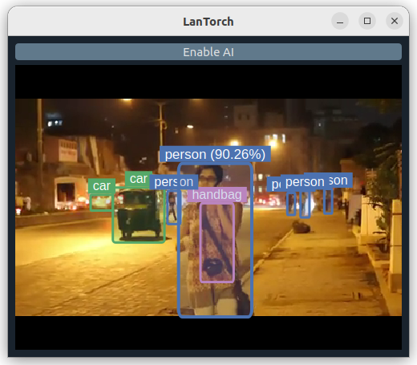

 LanTorch: Qt+Gstreamer+LibTorch Example App
======
[](LICENSE.txt)

This repo contains an example of mixing Qt with Gstreamer and LibTorch for video processing.
As I have found no similar prototype that is publicly available, I want to share this.

While it features Yolov8, it is not just another illustration of Yolov8 inferencing on C++.

<p align="center">
  
</p>

The code is extracted from **GastroEye** (another C++ computer-aided endoscopy app I have been working on,
unable to share sorry).
Hence, there could be many unused files that I have yet trimmed.

## Why not DeepStream?

Yes, a matured framework like DeepStream should have been the go-to choice.
However, the following table lists some of the reasons why we decided to migrate to LibTorch:

<table>
<caption>
Comparisons <i>(to be verified)</i>
</caption>

<tr>
<th>DeepStream</th>
<th>Qt+Gstreamer+LibTorch</th>
</tr>

<tr>
<td>

- Forced quantization (``TensorRT``) and the loss of performance is sometimes problematic.
    - But fast.
- Heavy pipeline initialization as models must be loaded during this stage.
- Not easy to dynamically configured when pipeline started, enabling/disabling requires manipulation of elements
  (like [this](https://gstreamer.freedesktop.org/documentation/application-development/advanced/pipeline-manipulation.html?gi-language=c#dynamically-changing-the-pipeline)).
- Fixed dense processing or sparse processing (e.g. once every 3 frames).
- Model outputs are drawn directly on the video, configurations are limited to those provided by the ``gst-nvdsosd``
  element.

</td>
<td>

- Fidelitous to training performance, or quantize/run on different ``dtype`` at will, just like PyTorch.
    - As fast as LibTorch (the backend of PyTorch) allows.
- Fast pipeline initialization as models are loaded on a different thread.
- Runtime hyperparameter flexibility, can be enabled/disabled easily.
- Sparse processing based on model availability.
    - This also means we can use arbitrarily large model running on a separate thread, and it _doesn't_ affect the
      video streaming pipeline.
- Interactiveness:
    - Model outputs are overlayed on the video using subclasses of ``QGraphicsItems``,
      which can be animated/interacted with.
    - Benefits from other Qt's infrastructures.

</td>
</tr>

<tr>
<td>

- Intrinsic synchronization.

</td>
<td>

- Not part of the pipeline, no synchronization, and not easy to enforce.
- A lot of hassle interacting with gstreamer and doing multi-threading.

</td>
</tr>

</table>

For the clinical use case in my project, LibTorch is the clear victor after the first bullet point.
Another the pivotal reason I did not list is the familiarity and reliance on the comforts given by
``torch``'s ecosystem.
Note that we still have full access to gstreamer and its plugins (including DeepStream).

## Requirements

### Operating System & Tools

- **Linux-based OS** _(preferably Ubuntu 22.04, no time to make it run on Windows but not impossible)_
- [CMake](https://cmake.org/download/)

### Libraries

- [yaml-cpp](https://github.com/jbeder/yaml-cpp)
- [fmt](https://github.com/fmtlib/fmt)
- [gstreamer](https://gstreamer.freedesktop.org/documentation/installing/on-linux.html?gi-language=c)
  and plugins:
    - [DeepStream SDK](https://docs.nvidia.com/metropolis/deepstream/dev-guide/text/DS_Quickstart.html)
      _(currently only used for tagging and other elements)_ and its dependencies listed in the link:
        - NVIDIA driver
        - CUDA
        - TensorRT
- [Qt5](https://wiki.qt.io/Install_Qt_5_on_Ubuntu)
    - [Qt5Gstreamer](https://github.com/GStreamer/qt-gstreamer): _(deprecated/unmaintained)_: for ``qwidget5videosink``
    - [qdarkstyle](https://github.com/ColinDuquesnoy/QDarkStyleSheet):
      _(already downloaded and placed in [resources/qdarkstyle](resources/qdarkstyle) but you may delete)_
- [LibTorch](https://pytorch.org/get-started/locally/): _(Tested for 2.3.0 but not sure about the lowest possible
  version)_
- [OpenCV](https://docs.opencv.org/4.x/d2/de6/tutorial_py_setup_in_ubuntu.html):
  _(Highly recommended to install from source **the latest possible version** if you plan to use the ``opencv2/dnn``
  submodule for inferencing on cuda device)_

#### Optional:

- [PillowResize](https://github.com/zurutech/pillow-resize): This allows the resize transform in
  ``dnn/torchvision/transforms.h`` to be identical to that of ``torchvision.transforms`` in python, but with performance
  tradeoff.

#### Unplanned/Deprecated:

- [nnstreamer](https://github.com/nnstreamer/nnstreamer) _(premature)_: An alternative of DeepStream with support for
  ``torchscript`` backend.

## Getting Started

### Project Structure

```
qt_gst_libtorch/
│   CMakeLists.txt
│   LICENSE.txt
│   README.md
└───data/             <== (optional) test videos
└───models/           <== (optional) where we store saved torchscript modules
└───resources/        <== where we store resources (icons, locales, etc.)
│   │   configs.yaml  <== all runtime parameters are defined here
│   │   ...
│
└───src
    └───app/          <== application-specific code
    └───dnn/          <== other folders store libraries' extensions that app relies on
    └───gst/              (meh design but whatever :D)
    └───qt/
    └───std/
    └───yaml-cpp/
    │   ...
```

### Configurations

App configs, including gstreamer pipeline description strings,
are defined in [``resources/configs.yaml``](resources/configs.yaml).

Note that in stem bin's description, there are two required named elements:

- ``tee name=inference_tee``: the fork point for all inference bins added later.
- ``qwidget5videosink name=display_sink``: video output for Qt.
- An element with name similar to that defined in ``app.gst.pipeline.frame_meta_probe.element``, whose pad we will
  plug a probe to register frame metas.

### Installation

#### Convert pre-trained weights to ``torchscript`` format

Create a folder named ``models``, convert the pre-trained weights of your choice to
``.torchscript`` format following [this documentation](https://pytorch.org/docs/stable/generated/torch.jit.save.html),
then put them inside the folder.

In this repo, we use the official pre-trained [yolov8s](https://github.com/ultralytics/ultralytics).
Be aware that their export script uses ``torch.jit.trace`` under the hood, so it is important to state the ``device``
parameter similar to that of your inference platform.

```
yolo export model=yolov8s.pt format=torchscript device=cuda
```

#### Compile and run

Make sure all the dependencies are installed.
If you downloaded LibTorch from https://pytorch.org/get-started/locally/, before running CMake, you need to define
``Torch_DIR`` environment variable pointing to the extracted ``libtorch`` directory.
Then, create a ``build`` folder and execute the standard CMake commands:

```
cmake -DCMAKE_BUILD_TYPE=Release -S . -B build
cmake --build build -j10 --
```

### Extending

#### Example 1: Adding a simple classification inference branch

This example assumes that you have a standard ``torch`` classification model [converted to ``.torchscript``](#convert-pre-trained-weights-to-torchscript-format)
format.

First, create a ``ClassificationInferenceWorker`` class that extends ``GstInferenceWorker``, overriding the
``setup()``, ``forward(const GstInferenceSample &)``, and ``cleanup()`` methods.
All these methods are to be executed on a separate thread.

```c++
#pragma once

#include "gst/gst_inference_qthread.h"

#undef slots  // guard all torch include with this

#include <torch/script.h>

#define slots Q_SLOTS

#include "dnn/torchvision/transforms.h"
#include "dnn/return_types.h"

class ClassificationInferenceWorker : public GstInferenceWorker {
Q_OBJECT
public:
    torch::jit::script::Module model;

    // The equivalence of torchvision.transform.
    // I know its typing is retarded :)
    using transform_type = torchvision::transforms::Compose<
            torchvision::transforms::ResizeToTensor<torchvision::transforms::RESIZE_BACKEND_OpenCV>,
            torchvision::transforms::Normalize>;
    transform_type *transform;

    std::string model_filepath;
    at::Device device;
    at::ScalarType dtype;

    ClassificationInferenceWorker(GstElement *app_sink,
                                  std::string_view model_filepath,
                                  at::Device device = at::kCPU,
                                  at::ScalarType dtype = at::kFloat)
            : GstInferenceWorker(app_sink),
              model_filepath(model_filepath),
              device(device),
              dtype(dtype) {
        // transform is light-weighted so it doesn't hurt to initialize here,
        // but you can also move it inside setup()
        transform = new torchvision::transforms::Compose(
                torchvision::transforms::ResizeToTensor<torchvision::transforms::RESIZE_BACKEND_OpenCV>(
                        {224, 224},
                        torchvision::transforms::INTERPOLATION_LINEAR,
                        false, false),
                torchvision::transforms::Normalize({0.485, 0.456, 0.406}, {0.229, 0.224, 0.225})
        );
    }

protected:
    /*
     * This method is executed before the inference loop.
     */
    void setup() override {
        try {
            // model loading should occur here
            model = torch::jit::load(model_filepath, device);
            model.to(dtype);
            model.eval();
        } catch (const c10::Error &e) {
            std::cerr << "error loading the models\n";
            throw e;
        }
    }

    /*
     * This method is executed during the inference loop and must be overridden.
     * 
     * It optionally returns a GstInferenceSample in case of shortcutting pipelines,
     * i.e. push model's output back into the pipeline through an appsrc. Otherwise,
     * just return std::nullopt.
     */
    std::optional<GstInferenceSample> forward(const GstInferenceSample &sample) override {
        auto frame_id = sample.frame_meta()->frame_num;
        auto img = sample.get_image();

        at::NoGradGuard g;
        auto x = transform->forward(img).to(device, dtype);

        // inference
        std::vector<torch::jit::IValue> inputs(1);
        inputs.clear();
        inputs.emplace(inputs.begin(), x.unsqueeze_(0));

        auto output = model.forward(inputs).toTensor().squeeze_(0);
        auto logits = output.softmax(0).cpu();
        int pred = logits.argmax().item<int>();

        // emit signals
        Classification clf_result;
        clf_result.label_id = pred;
        clf_result.probability = logits[pred].item<float>();
        emit new_sample_and_result(frame_id, sample, clf_result);
        emit new_result(frame_id, clf_result);
        return std::nullopt;
    }

    /*
     * This method is executed when the thread terminates.
     */
    void cleanup() override {
    }

signals:  // maybe you will need these signals

    void new_result(unsigned int frame_id,
                    const Classification &result);

    void new_sample_and_result(unsigned int frame_id,
                               const GstInferenceSample &sample,
                               const Classification &result);
};
```

After that, we need to register a new inference thread to ``MainWindow`` to handle this worker.
Please examine how I implemented these for Yolo in [src/app/dnn/yolo_inference_worker.h](src/app/dnn/yolo_inference_worker.h)
and [src/app/ui/main_window.cpp](src/app/ui/main_window.cpp), and adapt.

_More to be added on demand_

This project is just meant to be an example, and the paradigm is not very well-designed, please alter to your needs.

## License

The code is released under the MIT license, feel free to do anything. See [`LICENSE.txt`](LICENSE.txt) for details.
